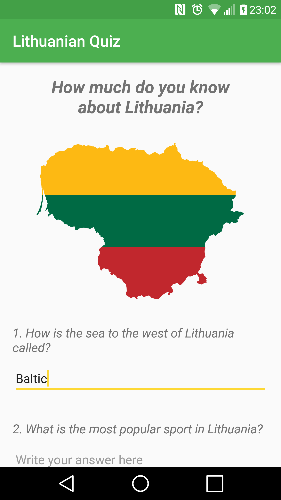
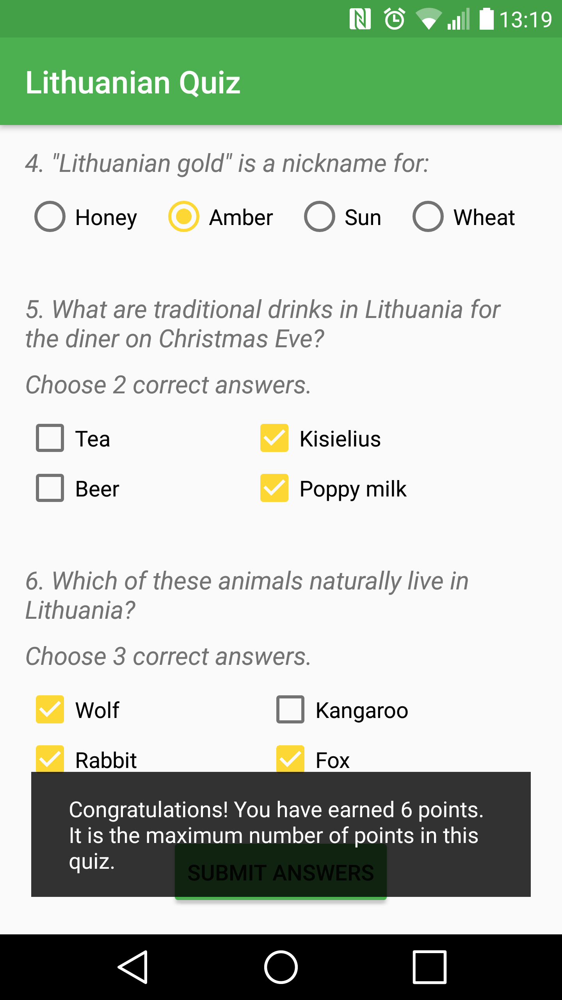

# LithuanianQuizProject

Lithuanian Quiz - Android Basics Nanodegree by Google (Project 3)

Lithuanian Quiz project is a part of Android Basics Nanodegree by Google.

Screenshots:

Description:

Lithuanian Quiz app is a quiz which tests user knowledge about Lithuania. 
After the user answers six questions and clicks "SUBMIT ANSWERS" button, 
points are logically and correctly counted and displayed in a ToastView.

I made this project to learn how to:
* implement various Views including CheckBoxes, RadioButtons and EditTexts
* track variables and implement correct (in this case, grading) logic
* write clean and clear code adhering to the best practices
* use if/else statements
* display a toast
